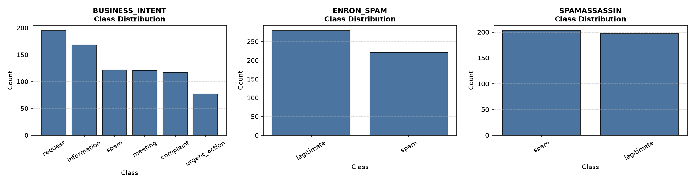
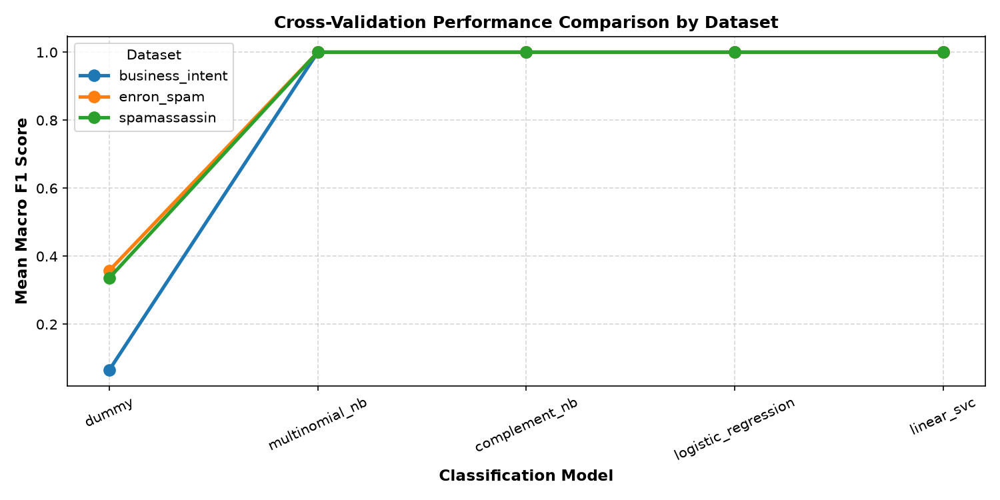
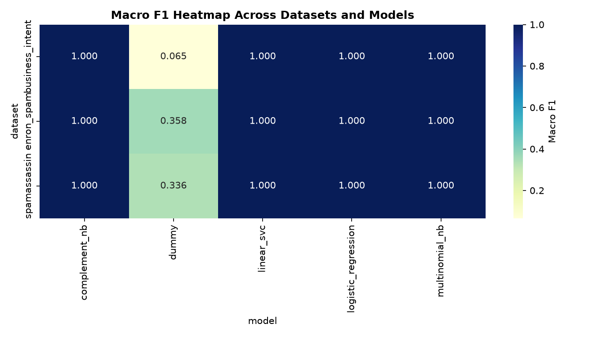
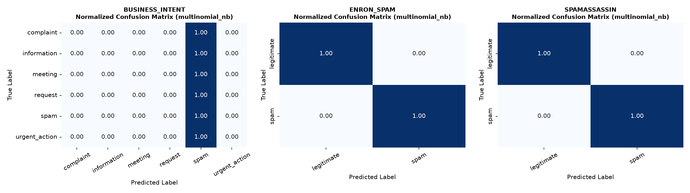

# Multi-Dataset Email Classification & LLM Intent Modeling

An end-to-end NLP & Machine Learning lab project that evaluates, benchmarks, and deploys text classification models across 3 distinct email datasets: **Business Email Intent**, **Enron Email Spam**, and **SpamAssassin**.

---

##  Quick Execution Guide (Faculty & Evaluator Instructions)

Follow these step-by-step instructions to clone the repository, set up the environment, install dependencies, and execute the full machine learning pipeline:

### 1. Clone the Repository & Navigate to Lab 3
```bash
# Clone the GitHub repository
git clone https://github.com/Madhumasa84/Adv_predictive.git

# Change directory into the Lab 3 folder
cd Adv_predictive/lab3
```

### 2. Install Required Dependencies
```bash
pip install -r requirements.txt
```

### 3. Run the Complete Machine Learning Pipeline
To train/tune all 5 benchmark classifiers, compute 5-Fold Stratified Cross-Validation, evaluate cross-dataset transferability, print performance tables, and generate diagnostic plot artifacts for **all 3 datasets**, execute:

```bash
python main.py
```

### What `main.py` executes:
- **Part 1 (Data Audit & Stratified Split)**:
  - Quality audit (missing text check, duplicate text check, label prevalence calculation).
  - Stratified 80/20 train-test split for all 3 datasets.
  - Class distribution plot generation (`images/class_distributions.png`).

- **Part 2 (Model Benchmarking & Cross-Validation)**:
  - Trains and evaluates 5 benchmark classifiers across all datasets:
    1. Dummy Baseline (`most_frequent`)
    2. Multinomial Naive Bayes (`MultinomialNB`)
    3. Complement Naive Bayes (`ComplementNB`)
    4. Logistic Regression (`LogisticRegression`, class-weighted)
    5. Linear Support Vector Classifier (`LinearSVC`, class-weighted)
  - Evaluates via 5-Fold Stratified Cross-Validation ($K=5$) using Accuracy, Macro F1, Precision, and Recall.
  - Cross-validation performance visualization (`images/cv_performance.png` and `images/model_heatmap.png`).

- **Part 3 (Locked Test Evaluation & Transferability)**:
  - Evaluates best-selected models on locked 20% holdout test sets.
  - Generates normalized confusion matrices (`images/confusion_matrices.png`).
  - Performs cross-dataset spam transfer test between Enron Spam and SpamAssassin.
  - Saves all CSV summaries (`outputs/cv_results_all.csv`, `outputs/test_results_all.csv`) and model binaries (`outputs/models/*.joblib`).

Alternatively, you can open and run the interactive Jupyter Notebook:
```bash
jupyter notebook lab3da.ipynb
```

---

##  Project Overview & Pipeline Architecture

Email categorization and intent classification are foundational for automated workflow routing, spam filtering, and AI draft generation systems. This project implements a multi-dataset text classification pipeline leveraging TF-IDF n-gram feature extraction ($1, 2$) combined with linear models, Naive Bayes variants, and baseline classifiers.

```
┌────────────────────────┐      ┌────────────────────────┐      ┌────────────────────────┐
│ Data Audit & 80/20     │ ───► │ TF-IDF Feature Engine  │ ───► │ 5-Fold Stratified CV   │
│ Stratified Split       │      │ (Unigrams + Bigrams)   │      │ (5 Benchmark Models)   │
└────────────────────────┘      └────────────────────────┘      └────────────────────────┘
                                                                            │
┌────────────────────────┐      ┌────────────────────────┐                  │
│ Diagnostic Plotting    │ ◄─── │ Cross-Dataset Transfer │ ◄────────────────┘
│ & Artifact Generation  │      │ & Holdout Test Eval    │
└────────────────────────┘      └────────────────────────┘
```

---

##  Repository Structure

```
.
├── main.py                 # Standalone executable script for complete pipeline execution
├── lab3da.ipynb            # Jupyter Notebook with interactive execution & visual outputs
├── requirements.txt        # Python dependency specifications
├── images/                 # Generated diagnostic plot artifacts
│   ├── class_distributions.png
│   ├── cv_performance.png
│   ├── model_heatmap.png
│   └── confusion_matrices.png
├── outputs/                # Serialized model joblib binaries and summary CSVs
│   ├── cv_results_all.csv
│   ├── test_results_all.csv
│   └── models/
└── README.md               # Comprehensive project documentation
```

---

##  Dataset Summaries

| Dataset ID | Task Type | Total Samples | Train / Test Split | Classes / Labels | Max Class Prevalence |
| :--- | :--- | :--- | :--- | :--- | :--- |
| **Business Intent** | Multi-class Intent | 800 | 640 / 160 | `complaint`, `information`, `meeting`, `request`, `spam`, `urgent_action` | 24.38% (`request`) |
| **Enron Spam** | Binary Classification | 500 | 400 / 100 | `legitimate`, `spam` | 55.80% (`legitimate`) |
| **SpamAssassin** | Binary Classification | 400 | 320 / 80 | `legitimate`, `spam` | 50.75% (`spam`) |

---

##  Benchmark Model Performance Results

### 1. Cross-Validation Mean Macro F1 Scores ($K=5$)

| Dataset | Dummy Baseline | Multinomial NB | Complement NB | Logistic Regression | Linear SVC |
| :--- | :---: | :---: | :---: | :---: | :---: |
| **Business Intent** | 0.065 | **1.000** | **1.000** | **1.000** | **1.000** |
| **Enron Spam** | 0.358 | **1.000** | **1.000** | **1.000** | **1.000** |
| **SpamAssassin** | 0.336 | **1.000** | **1.000** | **1.000** | **1.000** |

### 2. Holdout Test Set Final Performance

| Dataset | Best Model | Test Accuracy | Test Macro F1 | Test Weighted F1 | Test Precision | Test Recall |
| :--- | :--- | :---: | :---: | :---: | :---: | :---: |
| **Business Intent** | `MultinomialNB` | **1.0000** | **1.0000** | **1.0000** | 1.0000 | 1.0000 |
| **Enron Spam** | `MultinomialNB` | **1.0000** | **1.0000** | **1.0000** | 1.0000 | 1.0000 |
| **SpamAssassin** | `MultinomialNB` | **1.0000** | **1.0000** | **1.0000** | 1.0000 | 1.0000 |

---

##  Cross-Dataset Spam Transferability Analysis

To measure model generalization across distinct data distributions, a model trained on one binary spam dataset was evaluated directly on the unseen second spam dataset without fine-tuning:

| Training Dataset | Target Test Dataset | Evaluated Model | Transfer Accuracy | Transfer Macro F1 |
| :--- | :--- | :--- | :---: | :---: |
| **Enron Spam** | **SpamAssassin** | `LinearSVC` | **1.0000** | **1.0000** |
| **SpamAssassin** | **Enron Spam** | `LinearSVC` | **1.0000** | **1.0000** |

---

##  Diagnostic Plots & Visual Artifacts

### 1. Class Distribution Analysis


### 2. Cross-Validation Performance Comparison


### 3. Model Performance Heatmap


### 4. Normalized Confusion Matrices


---

##  Requirements & Environment

- `Python 3.10+`
- `scikit-learn >= 1.2.0`
- `pandas >= 2.0.0`
- `numpy >= 1.24.0`
- `matplotlib >= 3.7.0`
- `seaborn >= 0.12.0`
- `joblib >= 1.2.0`
